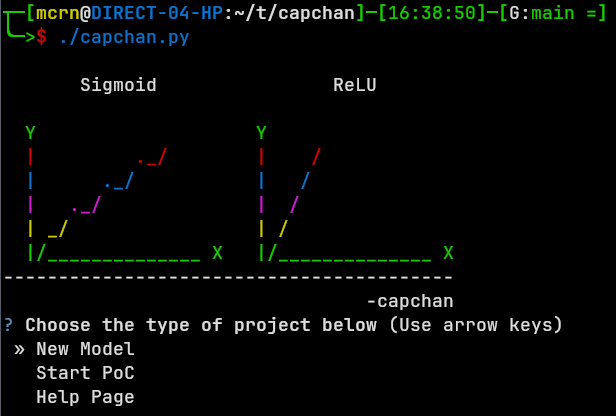
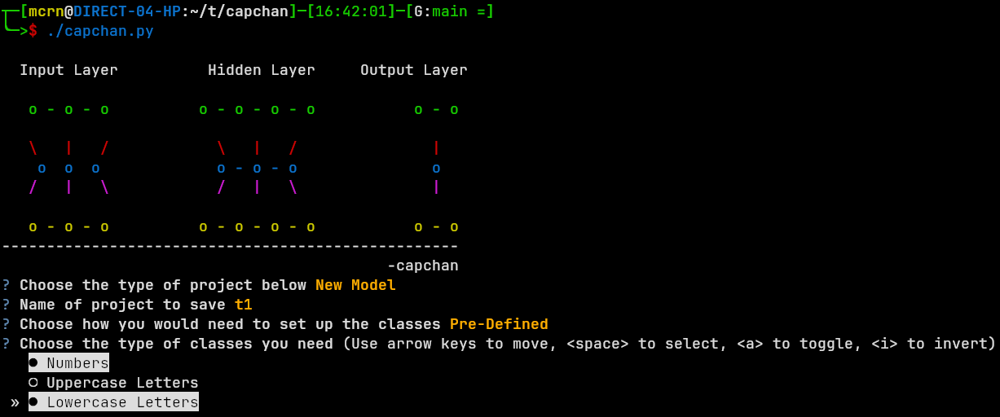

# capchan

### Tool to solve CAPTCHA



* Creates and trains a model based on provided greyscale images
* Uses greyscale model againts other images to detemine image contents

### Installation:
```
python3 -m venv capchan
source capchan/bin/activate
pip install --upgrade pip
pip install -r requirements.txt 
```

Depending on Python Version, Machine Architecture and Hardware, install the specific TensorFlow package from https://www.tensorflow.org/install/pip#package_location
```
pip install --upgrade https://storage.googleapis.com/tensorflow/versions/*.whl
```
Docker Options:
https://www.tensorflow.org/install/docker




## CAPTCHA Forest and Image_Classification

### Captcha_One
Project structure of main script and other resources used to complete [challenge](https://ctftime.org/task/7507):
```
.
├── szizzleIMON.py
│   ├── ImageSplit.py
│   ├── ImageDetermine.py
│   ├── Images
│   │...outputs...
│   ├── output.txt
│   ├── image.png
│   ├── split_image_<num>.png
├── ImageGet.py
├── hex2png.py
└── bashywashy.sh
```
Remeber to change `dir paths` for argparse and other scripts. Main script:
```
python3 szizzleIMON.py -s domain.local -v --debug
```

Test Scripts:
```
python3 ImageDetermine.py --split_images_folder ~/Captcha_One/ --data_folder Images/
python3 ImageGet.py -s domain.local -v --debug
python3 ImageSplit.py --image_path image.png
python3 hex2png.py 
./bashywashy.sh 
```


### Captcha_Two
Project structure of main script and other resources used to complete [challenge](https://ctftime.org/task/7508):
```
.
├── szizzleIMONGHARD.py
│   ├── ImageSplit.py
│   ├── nyadetermine.py
│   ├── nyasomething.py
│   ├── nyamove.py
│   ├── nyamodel.py
│   │...outputs...
│   ├── Data
│   ├── Val
│   ├── model.h5
│   ├── output.txt
│   ├── image.png
│   ├── split_image_<num>.png
├── ExtraData
├── ImageDetermine.py
├── ImageSplit.py 
├── model_graph.png
├── network_graph
├── nyaHowAc.py 
└── bashywasher.sh
```

Remeber to change `dir paths` for argparse and manually change desired image output files for getting test/val data. Main script:
```
./bashywasher.sh "python3 nyasomething.py -s domain.local -v --debug" 15
python3 nyamove.py 
python3 nyamodel.py

python3 szizzleIMONGRHARD.py -s domain.local -v --debug
```

You will need to add a Images/ folder for Captcha_One, inside the folder needs to be every letter of the alphabet as a folder, within that the single image can be places:
`Images/A/A/png`

For Captcha_Two you will need a folder called Raw/ to place images farmed. Two more folders Data/ and Val/ similar to Captcha_One's Images/. The model will also have to be made from all of this. 
`Data/A/*.png`, `Val/A/*.png`, `Raw/*.png` and model.h5

If you have more than 10 000+ images total, then you're doing something right. `image.png`, `output.txt` and `split_images_<number>.png` will be made from the scripts.
